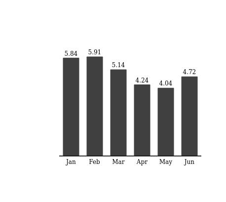
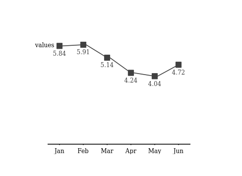

<!-- README.md is generated from README.Rmd. Please edit that file -->

# ibcsplot

<!-- badges: start -->

<!-- badges: end -->

The goal of ibcsplot is to enable R users to create charts inspired by
[International Business Communication Standards
(IBCS)](https://www.ibcs.com/). The plots are generated in SVG format,
so embedding them in HTML documents is straight forward.

## Installation

~~You can install the released version of ibcsplot from
[CRAN](https://CRAN.R-project.org) with:~~ The package is going to be
deployed to CRAN, so that the installation process will look like:

``` r
install.packages("ibcsplot")
```

But for now only development version from [GitHub](https://github.com/)
can be installed with:

``` r
# install.packages("devtools")
devtools::install_github("SawickiBartosz/ibcsplot")
```

## Example

How to create IBCS inspired charts using ibcsplot?

``` r
library(ibcsplot) # load the package
#> Loading required package: testthat
#> Loading required package: dplyr
#> 
#> Attaching package: 'dplyr'
#> The following object is masked from 'package:testthat':
#> 
#>     matches
#> The following objects are masked from 'package:stats':
#> 
#>     filter, lag
#> The following objects are masked from 'package:base':
#> 
#>     intersect, setdiff, setequal, union
#> Loading required package: htmlwidgets
#> Loading required package: lubridate
#> 
#> Attaching package: 'lubridate'
#> The following objects are masked from 'package:base':
#> 
#>     date, intersect, setdiff, union
#> Loading required package: stringr

# create some data to visualize
df <- data.frame(months = month.abb[1:6],
                 values = round(5 + sin(1:6), 2))

column_chart(df, x = 'months', series = 'values') %>% # create chart in a form of character vector containing SVG content
  SVGrenderer() # render and show the SVG 
```



You can easily create other type of plots, ie. lineplots:

``` r
line_plot(df, cat = df$months, series = 'values', series_labels = 'values') %>% 
  SVGrenderer()
#> Warning in min(neg): no non-missing arguments to min; returning Inf

#> Warning in min(neg): no non-missing arguments to min; returning Inf
```


