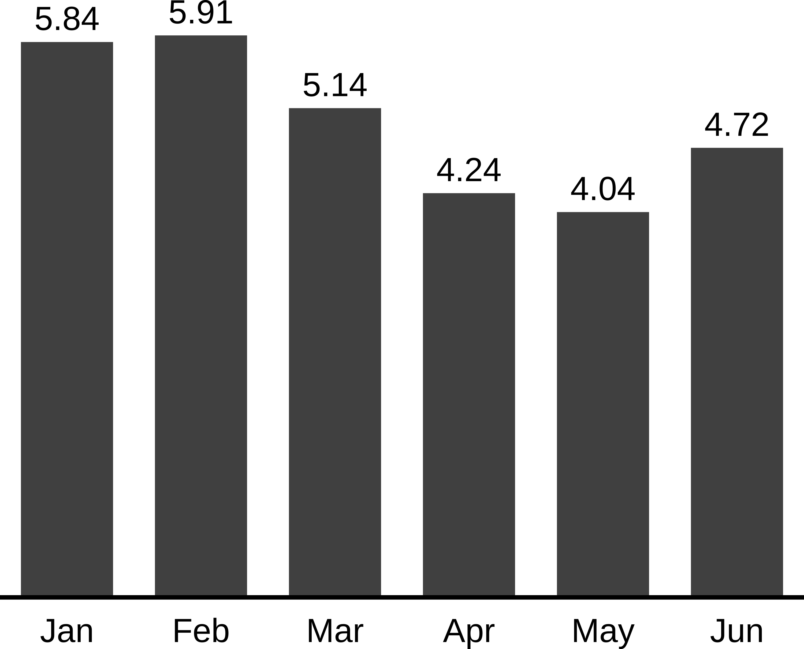
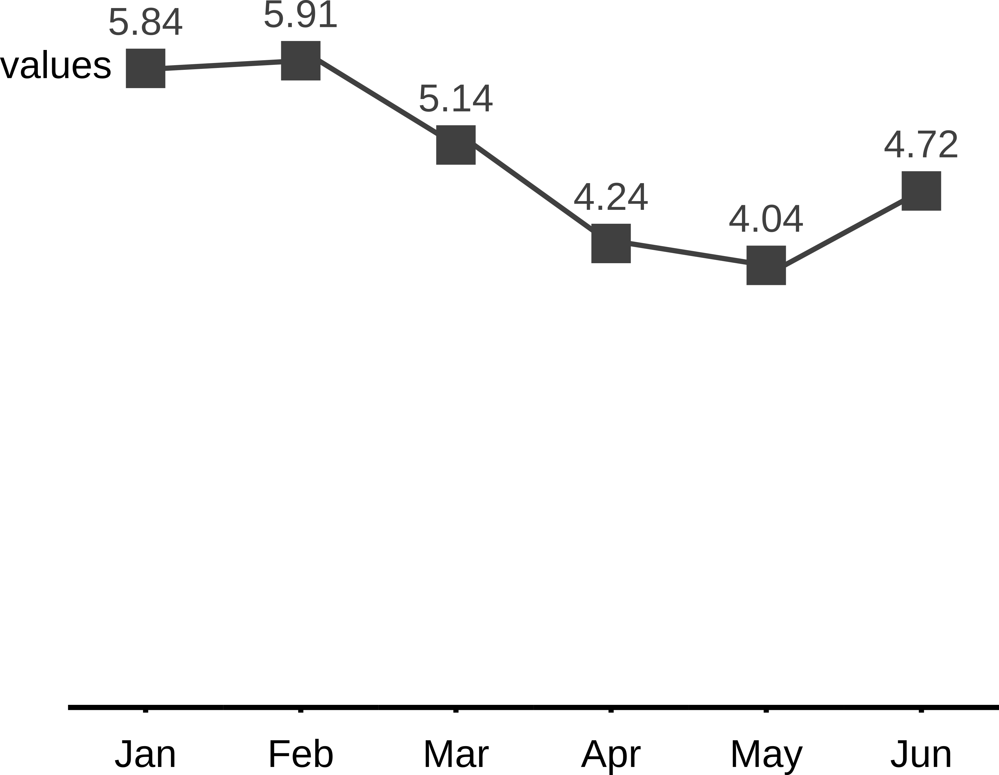

<!-- README.md is generated from README.Rmd. Please edit that file -->

# tidycharts

<!-- badges: start -->

[](https://codecov.io/gh/SawickiBartosz/tidycharts?branch=main)
<!-- badges: end -->

The goal of tidycharts is to enable R users to create charts inspired by
[International Business Communication Standards
(IBCS)](https://www.ibcs.com/). The plots are generated in SVG format,
so embedding them in HTML documents is straight forward.

## Installation

~~You can install the released version of tidycharts from
[CRAN](https://CRAN.R-project.org) with:~~ The package is going to be
deployed to CRAN, so that the installation process will look like:

``` r
install.packages("tidycharts")
```

But for now only development version from [GitHub](https://github.com/)
can be installed with:

``` r
devtools::install_github("MI2DataLab/tidycharts")
```

## Example

How to create IBCS inspired charts using tidycharts?

``` r
library(tidycharts) # load the package

# create some data to visualize
df <- data.frame(months = month.abb[1:6],
                 values = round(5 + sin(1:6), 2))

# create chart in a form of character vector containing SVG content
column_chart(df, x = 'months', series = 'values') %>%
  SVGrenderer() # render and show the SVG 
```

 You can easily create
other type of plots, ie. lineplots:

``` r
line_chart_markers(df, x = df$months, series = 'values', series_labels = 'values') %>% 
  SVGrenderer()
```


